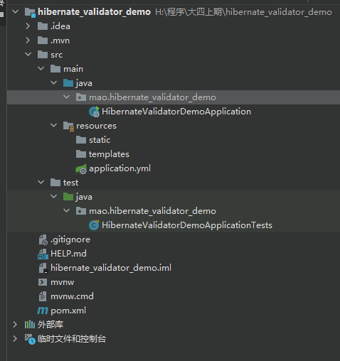
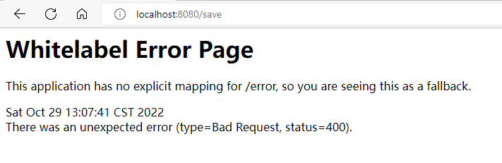
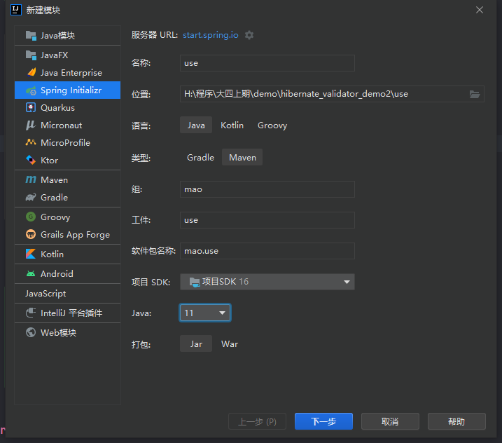
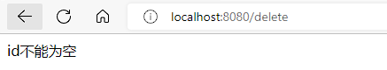
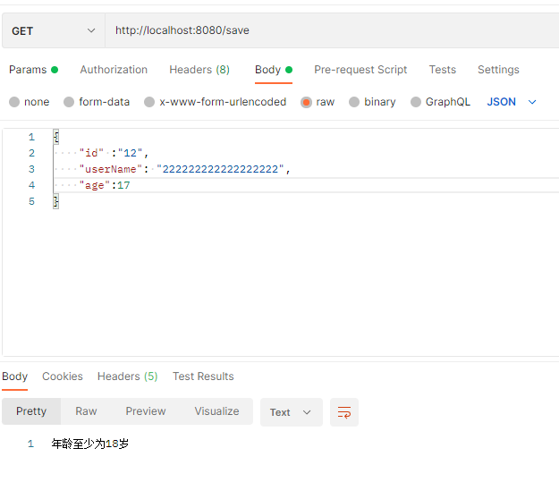
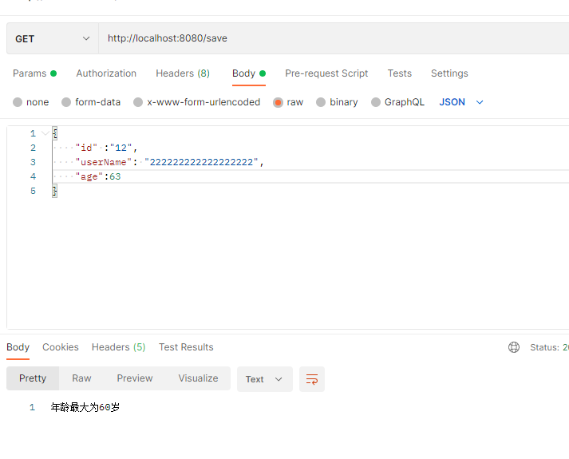

[TOC]

---


# hibernate validator

## 介绍

早期的网站，用户输入一个邮箱地址，需要将邮箱地址发送到服务端，服务端进行校验，校验成功后，给前端一个响应。

有了JavaScript后，校验工作可以放在前端去执行。那么为什么还需要服务端校验呢？ 因为前端传来的数据不可信。前端很容易获取到后端的接口，如果有人直接调用接口，就可能会出现非法数据，所以服务端也要数据校验。


总的来说：

* 前端校验：主要是提高用户体验
* 后端校验：主要是保证数据安全可靠


校验参数基本上是一个体力活，而且冗余代码繁多，也影响代码的可读性，我们需要一个比较优雅的方式来解决这个问题。Hibernate Validator 框架刚好解决了这个问题，可以以很优雅的方式实现参数的校验，让业务代码和校验逻辑分开,不再编写重复的校验逻辑。


hibernate-validator优势：

* 验证逻辑与业务逻辑之间进行了分离，降低了程序耦合度
* 统一且规范的验证方式，无需你再次编写重复的验证代码
* 你将更专注于你的业务，将这些繁琐的事情统统丢在一边


hibernate-validator的maven坐标：

```xml
<dependency>
      <groupId>org.hibernate</groupId>
      <artifactId>hibernate-validator</artifactId>
      <version>6.0.18.Final</version>
</dependency>
```


## 常用注解

hibernate-validator提供的校验方式为在类的属性上加入相应的注解来达到校验的目的。hibernate-validator提供的用于校验的注解如下：


|           注解            |                             说明                             |
| :-----------------------: | :----------------------------------------------------------: |
|        @AssertTrue        |              用于boolean字段，该字段只能为true               |
|       @AssertFalse        |              用于boolean字段，该字段只能为false              |
|     @CreditCardNumber     |                 对信用卡号进行一个大致的验证                 |
|        @DecimalMax        |                      只能小于或等于该值                      |
|        @DecimalMin        |                      只能大于或等于该值                      |
|          @Email           |                检查是否是一个有效的email地址                 |
|          @Future          |             检查该字段的日期是否是属于将来的日期             |
|    @Length(min=,max=)     |    检查所属的字段的长度是否在min和max之间,只能用于字符串     |
|           @Max            |                 该字段的值只能小于或等于该值                 |
|           @Min            |                 该字段的值只能大于或等于该值                 |
|         @NotNull          |                          不能为null                          |
|         @NotBlank         |                 不能为空，检查时会将空格忽略                 |
|         @NotEmpty         |                不能为空，这里的空是指空字符串                |
|     @Pattern(regex=)      |             被注释的元素必须符合指定的正则表达式             |
| @URL(protocol=,host,port) | 检查是否是一个有效的URL，如果提供了protocol，host等，则该URL还需满足提供的条件 |


## 入门案例


### 第一步：创建工程hibernate_validator_demo





### 第二步：修改pom文件


```xml
<?xml version="1.0" encoding="UTF-8"?>
<project xmlns="http://maven.apache.org/POM/4.0.0" xmlns:xsi="http://www.w3.org/2001/XMLSchema-instance"
         xsi:schemaLocation="http://maven.apache.org/POM/4.0.0 https://maven.apache.org/xsd/maven-4.0.0.xsd">
    <modelVersion>4.0.0</modelVersion>
    <parent>
        <groupId>org.springframework.boot</groupId>
        <artifactId>spring-boot-starter-parent</artifactId>
        <version>2.7.1</version>
        <relativePath/> <!-- lookup parent from repository -->
    </parent>
    <groupId>mao</groupId>
    <artifactId>hibernate_validator_demo</artifactId>
    <version>0.0.1-SNAPSHOT</version>
    <name>hibernate_validator_demo</name>
    <description>hibernate_validator_demo</description>
    <properties>
        <java.version>11</java.version>
    </properties>
    <dependencies>

        <dependency>
            <groupId>org.springframework.boot</groupId>
            <artifactId>spring-boot-starter-web</artifactId>
        </dependency>

        <dependency>
            <groupId>org.springframework.boot</groupId>
            <artifactId>spring-boot-starter-test</artifactId>
            <scope>test</scope>
        </dependency>

        <dependency>
            <groupId>org.hibernate</groupId>
            <artifactId>hibernate-validator</artifactId>
            <version>6.2.5.Final</version>
        </dependency>

    </dependencies>

    <build>
        <plugins>
            <plugin>
                <groupId>org.springframework.boot</groupId>
                <artifactId>spring-boot-maven-plugin</artifactId>
            </plugin>
        </plugins>
    </build>

</project>

```


### 第三步：创建User类


```java
package mao.hibernate_validator_demo.entity;

import org.hibernate.validator.constraints.Length;

import javax.validation.constraints.*;

/**
 * Project name(项目名称)：hibernate_validator_demo
 * Package(包名): mao.hibernate_validator_demo.entity
 * Class(类名): User
 * Author(作者）: mao
 * Author QQ：1296193245
 * GitHub：https://github.com/maomao124/
 * Date(创建日期)： 2022/10/29
 * Time(创建时间)： 12:47
 * Version(版本): 1.0
 * Description(描述)： 无
 */

public class User
{
    /**
     * id
     */
    private Integer id;
    /**
     * 用户名
     */
    private String userName;
    /**
     * 年龄
     */
    private Integer age;
    /**
     * 电子邮件
     */
    private String email;

    
}
```


### 第四步：添加对应的注解

```java
package mao.use.entity;

import org.hibernate.validator.constraints.Length;

import javax.validation.constraints.*;

/**
 * Project name(项目名称)：hibernate_validator_demo
 * Package(包名): mao.hibernate_validator_demo.entity
 * Class(类名): User
 * Author(作者）: mao
 * Author QQ：1296193245
 * GitHub：https://github.com/maomao124/
 * Date(创建日期)： 2022/10/29
 * Time(创建时间)： 12:47
 * Version(版本): 1.0
 * Description(描述)： 无
 */

public class User
{
    /**
     * id
     */
    @NotNull(message = "用户id不能为空")
    private Integer id;
    /**
     * 用户名
     */
    @NotEmpty(message = "用户名不能为空")
    @Length(max = 40, message = "用户名长度不能超过40位")
    private String userName;
    /**
     * 年龄
     */
    @Min(value = 18, message = "年龄至少为18岁")
    @Max(value = 60, message = "年龄最大为60岁")
    private Integer age;
    /**
     * 电子邮件
     */
    //@Email(message = "邮箱格式不正确")
    @Pattern(regexp = "[a-zA-Z0-9_-]+@[a-zA-Z0-9_-]+(\\\\.[a-zA-Z0-9_-]+)+$", message = "邮箱格式不正确")
    private String email;

    public Integer getId()
    {
        return id;
    }

    public void setId(Integer id)
    {
        this.id = id;
    }

    public String getUserName()
    {
        return userName;
    }

    public void setUserName(String userName)
    {
        this.userName = userName;
    }

    public Integer getAge()
    {
        return age;
    }

    public void setAge(Integer age)
    {
        this.age = age;
    }

    public String getEmail()
    {
        return email;
    }

    public void setEmail(String email)
    {
        this.email = email;
    }
}

```


### 第五步：创建UserController


```java
package mao.hibernate_validator_demo.controller;

import mao.hibernate_validator_demo.entity.User;
import org.slf4j.Logger;
import org.slf4j.LoggerFactory;
import org.springframework.validation.annotation.Validated;
import org.springframework.web.bind.annotation.RequestBody;
import org.springframework.web.bind.annotation.RequestMapping;
import org.springframework.web.bind.annotation.RestController;

import javax.validation.constraints.NotBlank;

/**
 * Project name(项目名称)：hibernate_validator_demo
 * Package(包名): mao.hibernate_validator_demo.controller
 * Class(类名): UserController
 * Author(作者）: mao
 * Author QQ：1296193245
 * GitHub：https://github.com/maomao124/
 * Date(创建日期)： 2022/10/29
 * Time(创建时间)： 13:01
 * Version(版本): 1.0
 * Description(描述)： 无
 */

@RestController
//开启校验
@Validated
public class UserController
{
    private static final Logger log = LoggerFactory.getLogger(UserController.class);

    @RequestMapping("/delete")
    public String delete(@NotBlank(message = "id不能为空") String id)
    {
        log.info("delete..." + id);
        return "OK";
    }

    @RequestMapping("/save")
    public String save(@Validated @RequestBody User user)
    {
        log.info("save..." + user);
        return "OK";
    }
}
```


### 第六步：启动程序


```sh
 .   ____          _            __ _ _
 /\\ / ___'_ __ _ _(_)_ __  __ _ \ \ \ \
( ( )\___ | '_ | '_| | '_ \/ _` | \ \ \ \
 \\/  ___)| |_)| | | | | || (_| |  ) ) ) )
  '  |____| .__|_| |_|_| |_\__, | / / / /
 =========|_|==============|___/=/_/_/_/
 :: Spring Boot ::                (v2.7.1)

2022-10-29 13:05:35.506  INFO 19760 --- [           main] m.h.HibernateValidatorDemoApplication    : Starting HibernateValidatorDemoApplication using Java 16.0.2 on mao with PID 19760 (H:\程序\大四上期\hibernate_validator_demo\target\classes started by mao in H:\程序\大四上期\hibernate_validator_demo)
2022-10-29 13:05:35.509  INFO 19760 --- [           main] m.h.HibernateValidatorDemoApplication    : No active profile set, falling back to 1 default profile: "default"
2022-10-29 13:05:36.212  INFO 19760 --- [           main] o.s.b.w.embedded.tomcat.TomcatWebServer  : Tomcat initialized with port(s): 8080 (http)
2022-10-29 13:05:36.220  INFO 19760 --- [           main] o.apache.catalina.core.StandardService   : Starting service [Tomcat]
2022-10-29 13:05:36.220  INFO 19760 --- [           main] org.apache.catalina.core.StandardEngine  : Starting Servlet engine: [Apache Tomcat/9.0.64]
2022-10-29 13:05:36.296  INFO 19760 --- [           main] o.a.c.c.C.[Tomcat].[localhost].[/]       : Initializing Spring embedded WebApplicationContext
2022-10-29 13:05:36.296  INFO 19760 --- [           main] w.s.c.ServletWebServerApplicationContext : Root WebApplicationContext: initialization completed in 744 ms
2022-10-29 13:05:36.546  INFO 19760 --- [           main] o.s.b.w.embedded.tomcat.TomcatWebServer  : Tomcat started on port(s): 8080 (http) with context path ''
2022-10-29 13:05:36.556  INFO 19760 --- [           main] m.h.HibernateValidatorDemoApplication    : Started HibernateValidatorDemoApplication in 1.324 seconds (JVM running for 1.88)
```


### 第七步：访问


http://localhost:8080/delete


http://localhost:8080/save





```sh
2022-10-29 13:10:06.254 ERROR 2412 --- [nio-8080-exec-5] o.a.c.c.C.[.[.[/].[dispatcherServlet]    : Servlet.service() for servlet [dispatcherServlet] in context with path [] threw exception [Request processing failed; nested exception is javax.validation.ConstraintViolationException: delete.id: id不能为空] with root cause

javax.validation.ConstraintViolationException: delete.id: id不能为空
	at org.springframework.validation.beanvalidation.MethodValidationInterceptor.invoke(MethodValidationInterceptor.java:120) ~[spring-context-5.3.21.jar:5.3.21]
	at org.springframework.aop.framework.ReflectiveMethodInvocation.proceed(ReflectiveMethodInvocation.java:186) ~[spring-aop-5.3.21.jar:5.3.21]
	at org.springframework.aop.framework.CglibAopProxy$CglibMethodInvocation.proceed(CglibAopProxy.java:763) ~[spring-aop-5.3.21.jar:5.3.21]
	at org.springframework.aop.framework.CglibAopProxy$DynamicAdvisedInterceptor.intercept(CglibAopProxy.java:708) ~[spring-aop-5.3.21.jar:5.3.21]
	at mao.hibernate_validator_demo.controller.UserController$$EnhancerBySpringCGLIB$$648dd9df.delete(<generated>) ~[classes/:na]
	at java.base/jdk.internal.reflect.NativeMethodAccessorImpl.invoke0(Native Method) ~[na:na]
	at java.base/jdk.internal.reflect.NativeMethodAccessorImpl.invoke(NativeMethodAccessorImpl.java:78) ~[na:na]
	at java.base/jdk.internal.reflect.DelegatingMethodAccessorImpl.invoke(DelegatingMethodAccessorImpl.java:43) ~[na:na]
	at java.base/java.lang.reflect.Method.invoke(Method.java:567) ~[na:na]
	at org.springframework.web.method.support.InvocableHandlerMethod.doInvoke(InvocableHandlerMethod.java:205) ~[spring-web-5.3.21.jar:5.3.21]
	at org.springframework.web.method.support.InvocableHandlerMethod.invokeForRequest(InvocableHandlerMethod.java:150) ~[spring-web-5.3.21.jar:5.3.21]
	at org.springframework.web.servlet.mvc.method.annotation.ServletInvocableHandlerMethod.invokeAndHandle(ServletInvocableHandlerMethod.java:117) ~[spring-webmvc-5.3.21.jar:5.3.21]
	at org.springframework.web.servlet.mvc.method.annotation.RequestMappingHandlerAdapter.invokeHandlerMethod(RequestMappingHandlerAdapter.java:895) ~[spring-webmvc-5.3.21.jar:5.3.21]
	at org.springframework.web.servlet.mvc.method.annotation.RequestMappingHandlerAdapter.handleInternal(RequestMappingHandlerAdapter.java:808) ~[spring-webmvc-5.3.21.jar:5.3.21]
	at org.springframework.web.servlet.mvc.method.AbstractHandlerMethodAdapter.handle(AbstractHandlerMethodAdapter.java:87) ~[spring-webmvc-5.3.21.jar:5.3.21]
	at org.springframework.web.servlet.DispatcherServlet.doDispatch(DispatcherServlet.java:1067) ~[spring-webmvc-5.3.21.jar:5.3.21]
	at org.springframework.web.servlet.DispatcherServlet.doService(DispatcherServlet.java:963) ~[spring-webmvc-5.3.21.jar:5.3.21]
	at org.springframework.web.servlet.FrameworkServlet.processRequest(FrameworkServlet.java:1006) ~[spring-webmvc-5.3.21.jar:5.3.21]
	at org.springframework.web.servlet.FrameworkServlet.doGet(FrameworkServlet.java:898) ~[spring-webmvc-5.3.21.jar:5.3.21]
	at javax.servlet.http.HttpServlet.service(HttpServlet.java:655) ~[tomcat-embed-core-9.0.64.jar:4.0.FR]
	at org.springframework.web.servlet.FrameworkServlet.service(FrameworkServlet.java:883) ~[spring-webmvc-5.3.21.jar:5.3.21]
	at javax.servlet.http.HttpServlet.service(HttpServlet.java:764) ~[tomcat-embed-core-9.0.64.jar:4.0.FR]
	at org.apache.catalina.core.ApplicationFilterChain.internalDoFilter(ApplicationFilterChain.java:227) ~[tomcat-embed-core-9.0.64.jar:9.0.64]
	at org.apache.catalina.core.ApplicationFilterChain.doFilter(ApplicationFilterChain.java:162) ~[tomcat-embed-core-9.0.64.jar:9.0.64]
	at org.apache.tomcat.websocket.server.WsFilter.doFilter(WsFilter.java:53) ~[tomcat-embed-websocket-9.0.64.jar:9.0.64]
	at org.apache.catalina.core.ApplicationFilterChain.internalDoFilter(ApplicationFilterChain.java:189) ~[tomcat-embed-core-9.0.64.jar:9.0.64]
	at org.apache.catalina.core.ApplicationFilterChain.doFilter(ApplicationFilterChain.java:162) ~[tomcat-embed-core-9.0.64.jar:9.0.64]
	at org.springframework.web.filter.RequestContextFilter.doFilterInternal(RequestContextFilter.java:100) ~[spring-web-5.3.21.jar:5.3.21]
	at org.springframework.web.filter.OncePerRequestFilter.doFilter(OncePerRequestFilter.java:117) ~[spring-web-5.3.21.jar:5.3.21]
	at org.apache.catalina.core.ApplicationFilterChain.internalDoFilter(ApplicationFilterChain.java:189) ~[tomcat-embed-core-9.0.64.jar:9.0.64]
	at org.apache.catalina.core.ApplicationFilterChain.doFilter(ApplicationFilterChain.java:162) ~[tomcat-embed-core-9.0.64.jar:9.0.64]
	at org.springframework.web.filter.FormContentFilter.doFilterInternal(FormContentFilter.java:93) ~[spring-web-5.3.21.jar:5.3.21]
	at org.springframework.web.filter.OncePerRequestFilter.doFilter(OncePerRequestFilter.java:117) ~[spring-web-5.3.21.jar:5.3.21]
	at org.apache.catalina.core.ApplicationFilterChain.internalDoFilter(ApplicationFilterChain.java:189) ~[tomcat-embed-core-9.0.64.jar:9.0.64]
	at org.apache.catalina.core.ApplicationFilterChain.doFilter(ApplicationFilterChain.java:162) ~[tomcat-embed-core-9.0.64.jar:9.0.64]
	at org.springframework.web.filter.CharacterEncodingFilter.doFilterInternal(CharacterEncodingFilter.java:201) ~[spring-web-5.3.21.jar:5.3.21]
	at org.springframework.web.filter.OncePerRequestFilter.doFilter(OncePerRequestFilter.java:117) ~[spring-web-5.3.21.jar:5.3.21]
	at org.apache.catalina.core.ApplicationFilterChain.internalDoFilter(ApplicationFilterChain.java:189) ~[tomcat-embed-core-9.0.64.jar:9.0.64]
	at org.apache.catalina.core.ApplicationFilterChain.doFilter(ApplicationFilterChain.java:162) ~[tomcat-embed-core-9.0.64.jar:9.0.64]
	at org.apache.catalina.core.StandardWrapperValve.invoke(StandardWrapperValve.java:197) ~[tomcat-embed-core-9.0.64.jar:9.0.64]
	at org.apache.catalina.core.StandardContextValve.invoke(StandardContextValve.java:97) ~[tomcat-embed-core-9.0.64.jar:9.0.64]
	at org.apache.catalina.authenticator.AuthenticatorBase.invoke(AuthenticatorBase.java:541) ~[tomcat-embed-core-9.0.64.jar:9.0.64]
	at org.apache.catalina.core.StandardHostValve.invoke(StandardHostValve.java:135) ~[tomcat-embed-core-9.0.64.jar:9.0.64]
	at org.apache.catalina.valves.ErrorReportValve.invoke(ErrorReportValve.java:92) ~[tomcat-embed-core-9.0.64.jar:9.0.64]
	at org.apache.catalina.core.StandardEngineValve.invoke(StandardEngineValve.java:78) ~[tomcat-embed-core-9.0.64.jar:9.0.64]
	at org.apache.catalina.connector.CoyoteAdapter.service(CoyoteAdapter.java:360) ~[tomcat-embed-core-9.0.64.jar:9.0.64]
	at org.apache.coyote.http11.Http11Processor.service(Http11Processor.java:399) ~[tomcat-embed-core-9.0.64.jar:9.0.64]
	at org.apache.coyote.AbstractProcessorLight.process(AbstractProcessorLight.java:65) ~[tomcat-embed-core-9.0.64.jar:9.0.64]
	at org.apache.coyote.AbstractProtocol$ConnectionHandler.process(AbstractProtocol.java:890) ~[tomcat-embed-core-9.0.64.jar:9.0.64]
	at org.apache.tomcat.util.net.NioEndpoint$SocketProcessor.doRun(NioEndpoint.java:1787) ~[tomcat-embed-core-9.0.64.jar:9.0.64]
	at org.apache.tomcat.util.net.SocketProcessorBase.run(SocketProcessorBase.java:49) ~[tomcat-embed-core-9.0.64.jar:9.0.64]
	at org.apache.tomcat.util.threads.ThreadPoolExecutor.runWorker(ThreadPoolExecutor.java:1191) ~[tomcat-embed-core-9.0.64.jar:9.0.64]
	at org.apache.tomcat.util.threads.ThreadPoolExecutor$Worker.run(ThreadPoolExecutor.java:659) ~[tomcat-embed-core-9.0.64.jar:9.0.64]
	at org.apache.tomcat.util.threads.TaskThread$WrappingRunnable.run(TaskThread.java:61) ~[tomcat-embed-core-9.0.64.jar:9.0.64]
	at java.base/java.lang.Thread.run(Thread.java:831) ~[na:na]

2022-10-29 13:10:08.522 ERROR 2412 --- [nio-8080-exec-4] o.a.c.c.C.[.[.[/].[dispatcherServlet]    : Servlet.service() for servlet [dispatcherServlet] in context with path [] threw exception [Request processing failed; nested exception is javax.validation.ConstraintViolationException: delete.id: id不能为空] with root cause

javax.validation.ConstraintViolationException: delete.id: id不能为空
	at org.springframework.validation.beanvalidation.MethodValidationInterceptor.invoke(MethodValidationInterceptor.java:120) ~[spring-context-5.3.21.jar:5.3.21]
	at org.springframework.aop.framework.ReflectiveMethodInvocation.proceed(ReflectiveMethodInvocation.java:186) ~[spring-aop-5.3.21.jar:5.3.21]
	at org.springframework.aop.framework.CglibAopProxy$CglibMethodInvocation.proceed(CglibAopProxy.java:763) ~[spring-aop-5.3.21.jar:5.3.21]
	at org.springframework.aop.framework.CglibAopProxy$DynamicAdvisedInterceptor.intercept(CglibAopProxy.java:708) ~[spring-aop-5.3.21.jar:5.3.21]
	at mao.hibernate_validator_demo.controller.UserController$$EnhancerBySpringCGLIB$$648dd9df.delete(<generated>) ~[classes/:na]
	at java.base/jdk.internal.reflect.NativeMethodAccessorImpl.invoke0(Native Method) ~[na:na]
	at java.base/jdk.internal.reflect.NativeMethodAccessorImpl.invoke(NativeMethodAccessorImpl.java:78) ~[na:na]
	at java.base/jdk.internal.reflect.DelegatingMethodAccessorImpl.invoke(DelegatingMethodAccessorImpl.java:43) ~[na:na]
	at java.base/java.lang.reflect.Method.invoke(Method.java:567) ~[na:na]
	at org.springframework.web.method.support.InvocableHandlerMethod.doInvoke(InvocableHandlerMethod.java:205) ~[spring-web-5.3.21.jar:5.3.21]
	at org.springframework.web.method.support.InvocableHandlerMethod.invokeForRequest(InvocableHandlerMethod.java:150) ~[spring-web-5.3.21.jar:5.3.21]
	at org.springframework.web.servlet.mvc.method.annotation.ServletInvocableHandlerMethod.invokeAndHandle(ServletInvocableHandlerMethod.java:117) ~[spring-webmvc-5.3.21.jar:5.3.21]
	at org.springframework.web.servlet.mvc.method.annotation.RequestMappingHandlerAdapter.invokeHandlerMethod(RequestMappingHandlerAdapter.java:895) ~[spring-webmvc-5.3.21.jar:5.3.21]
	at org.springframework.web.servlet.mvc.method.annotation.RequestMappingHandlerAdapter.handleInternal(RequestMappingHandlerAdapter.java:808) ~[spring-webmvc-5.3.21.jar:5.3.21]
	at org.springframework.web.servlet.mvc.method.AbstractHandlerMethodAdapter.handle(AbstractHandlerMethodAdapter.java:87) ~[spring-webmvc-5.3.21.jar:5.3.21]
	at org.springframework.web.servlet.DispatcherServlet.doDispatch(DispatcherServlet.java:1067) ~[spring-webmvc-5.3.21.jar:5.3.21]
	at org.springframework.web.servlet.DispatcherServlet.doService(DispatcherServlet.java:963) ~[spring-webmvc-5.3.21.jar:5.3.21]
	at org.springframework.web.servlet.FrameworkServlet.processRequest(FrameworkServlet.java:1006) ~[spring-webmvc-5.3.21.jar:5.3.21]
	at org.springframework.web.servlet.FrameworkServlet.doGet(FrameworkServlet.java:898) ~[spring-webmvc-5.3.21.jar:5.3.21]
	at javax.servlet.http.HttpServlet.service(HttpServlet.java:655) ~[tomcat-embed-core-9.0.64.jar:4.0.FR]
	at org.springframework.web.servlet.FrameworkServlet.service(FrameworkServlet.java:883) ~[spring-webmvc-5.3.21.jar:5.3.21]
	at javax.servlet.http.HttpServlet.service(HttpServlet.java:764) ~[tomcat-embed-core-9.0.64.jar:4.0.FR]
	at org.apache.catalina.core.ApplicationFilterChain.internalDoFilter(ApplicationFilterChain.java:227) ~[tomcat-embed-core-9.0.64.jar:9.0.64]
	at org.apache.catalina.core.ApplicationFilterChain.doFilter(ApplicationFilterChain.java:162) ~[tomcat-embed-core-9.0.64.jar:9.0.64]
	at org.apache.tomcat.websocket.server.WsFilter.doFilter(WsFilter.java:53) ~[tomcat-embed-websocket-9.0.64.jar:9.0.64]
	at org.apache.catalina.core.ApplicationFilterChain.internalDoFilter(ApplicationFilterChain.java:189) ~[tomcat-embed-core-9.0.64.jar:9.0.64]
	at org.apache.catalina.core.ApplicationFilterChain.doFilter(ApplicationFilterChain.java:162) ~[tomcat-embed-core-9.0.64.jar:9.0.64]
	at org.springframework.web.filter.RequestContextFilter.doFilterInternal(RequestContextFilter.java:100) ~[spring-web-5.3.21.jar:5.3.21]
	at org.springframework.web.filter.OncePerRequestFilter.doFilter(OncePerRequestFilter.java:117) ~[spring-web-5.3.21.jar:5.3.21]
	at org.apache.catalina.core.ApplicationFilterChain.internalDoFilter(ApplicationFilterChain.java:189) ~[tomcat-embed-core-9.0.64.jar:9.0.64]
	at org.apache.catalina.core.ApplicationFilterChain.doFilter(ApplicationFilterChain.java:162) ~[tomcat-embed-core-9.0.64.jar:9.0.64]
	at org.springframework.web.filter.FormContentFilter.doFilterInternal(FormContentFilter.java:93) ~[spring-web-5.3.21.jar:5.3.21]
	at org.springframework.web.filter.OncePerRequestFilter.doFilter(OncePerRequestFilter.java:117) ~[spring-web-5.3.21.jar:5.3.21]
	at org.apache.catalina.core.ApplicationFilterChain.internalDoFilter(ApplicationFilterChain.java:189) ~[tomcat-embed-core-9.0.64.jar:9.0.64]
	at org.apache.catalina.core.ApplicationFilterChain.doFilter(ApplicationFilterChain.java:162) ~[tomcat-embed-core-9.0.64.jar:9.0.64]
	at org.springframework.web.filter.CharacterEncodingFilter.doFilterInternal(CharacterEncodingFilter.java:201) ~[spring-web-5.3.21.jar:5.3.21]
	at org.springframework.web.filter.OncePerRequestFilter.doFilter(OncePerRequestFilter.java:117) ~[spring-web-5.3.21.jar:5.3.21]
	at org.apache.catalina.core.ApplicationFilterChain.internalDoFilter(ApplicationFilterChain.java:189) ~[tomcat-embed-core-9.0.64.jar:9.0.64]
	at org.apache.catalina.core.ApplicationFilterChain.doFilter(ApplicationFilterChain.java:162) ~[tomcat-embed-core-9.0.64.jar:9.0.64]
	at org.apache.catalina.core.StandardWrapperValve.invoke(StandardWrapperValve.java:197) ~[tomcat-embed-core-9.0.64.jar:9.0.64]
	at org.apache.catalina.core.StandardContextValve.invoke(StandardContextValve.java:97) ~[tomcat-embed-core-9.0.64.jar:9.0.64]
	at org.apache.catalina.authenticator.AuthenticatorBase.invoke(AuthenticatorBase.java:541) ~[tomcat-embed-core-9.0.64.jar:9.0.64]
	at org.apache.catalina.core.StandardHostValve.invoke(StandardHostValve.java:135) ~[tomcat-embed-core-9.0.64.jar:9.0.64]
	at org.apache.catalina.valves.ErrorReportValve.invoke(ErrorReportValve.java:92) ~[tomcat-embed-core-9.0.64.jar:9.0.64]
	at org.apache.catalina.core.StandardEngineValve.invoke(StandardEngineValve.java:78) ~[tomcat-embed-core-9.0.64.jar:9.0.64]
	at org.apache.catalina.connector.CoyoteAdapter.service(CoyoteAdapter.java:360) ~[tomcat-embed-core-9.0.64.jar:9.0.64]
	at org.apache.coyote.http11.Http11Processor.service(Http11Processor.java:399) ~[tomcat-embed-core-9.0.64.jar:9.0.64]
	at org.apache.coyote.AbstractProcessorLight.process(AbstractProcessorLight.java:65) ~[tomcat-embed-core-9.0.64.jar:9.0.64]
	at org.apache.coyote.AbstractProtocol$ConnectionHandler.process(AbstractProtocol.java:890) ~[tomcat-embed-core-9.0.64.jar:9.0.64]
	at org.apache.tomcat.util.net.NioEndpoint$SocketProcessor.doRun(NioEndpoint.java:1787) ~[tomcat-embed-core-9.0.64.jar:9.0.64]
	at org.apache.tomcat.util.net.SocketProcessorBase.run(SocketProcessorBase.java:49) ~[tomcat-embed-core-9.0.64.jar:9.0.64]
	at org.apache.tomcat.util.threads.ThreadPoolExecutor.runWorker(ThreadPoolExecutor.java:1191) ~[tomcat-embed-core-9.0.64.jar:9.0.64]
	at org.apache.tomcat.util.threads.ThreadPoolExecutor$Worker.run(ThreadPoolExecutor.java:659) ~[tomcat-embed-core-9.0.64.jar:9.0.64]
	at org.apache.tomcat.util.threads.TaskThread$WrappingRunnable.run(TaskThread.java:61) ~[tomcat-embed-core-9.0.64.jar:9.0.64]
	at java.base/java.lang.Thread.run(Thread.java:831) ~[na:na]

2022-10-29 13:10:12.624  WARN 2412 --- [nio-8080-exec-6] .w.s.m.s.DefaultHandlerExceptionResolver : Resolved [org.springframework.http.converter.HttpMessageNotReadableException: Required request body is missing: public java.lang.String mao.hibernate_validator_demo.controller.UserController.save(mao.hibernate_validator_demo.entity.User)]

```


**为了能够在页面友好的显示数据校验结果，可以通过全局异常处理来解决**

### 第八步：创建全局异常处理类


```java
package mao.hibernate_validator_demo.controller;

import org.slf4j.Logger;
import org.slf4j.LoggerFactory;
import org.springframework.validation.BindException;
import org.springframework.web.bind.annotation.ControllerAdvice;
import org.springframework.web.bind.annotation.ExceptionHandler;
import org.springframework.web.bind.annotation.RestControllerAdvice;

import javax.servlet.http.HttpServletRequest;
import javax.validation.ConstraintViolation;
import javax.validation.ConstraintViolationException;
import java.util.Objects;
import java.util.Set;

/**
 * Project name(项目名称)：hibernate_validator_demo
 * Package(包名): mao.hibernate_validator_demo.controller
 * Class(类名): ExceptionConfiguration
 * Author(作者）: mao
 * Author QQ：1296193245
 * GitHub：https://github.com/maomao124/
 * Date(创建日期)： 2022/10/29
 * Time(创建时间)： 13:12
 * Version(版本): 1.0
 * Description(描述)： 无
 */


@RestControllerAdvice
public class ExceptionConfiguration
{

    private static final Logger log = LoggerFactory.getLogger(ExceptionConfiguration.class);

    @ExceptionHandler({ConstraintViolationException.class, BindException.class})
    public String validateException(Exception ex, HttpServletRequest request)
    {
        log.error("异常：", ex);
        String msg = null;
        if (ex instanceof ConstraintViolationException)
        {
            ConstraintViolationException constraintViolationException =
                    (ConstraintViolationException) ex;
            Set<ConstraintViolation<?>> violations =
                    constraintViolationException.getConstraintViolations();
            ConstraintViolation<?> next = violations.iterator().next();
            msg = next.getMessage();
        }
        else if (ex instanceof BindException)
        {
            BindException bindException = (BindException) ex;
            msg = Objects.requireNonNull(bindException.getBindingResult().getFieldError()).getDefaultMessage();
        }
        return msg;
    }
}

```


### 第九步：重启程序


### 第十步：访问


http://localhost:8080/delete


```sh
2022-10-29 13:18:54.922 ERROR 2416 --- [nio-8080-exec-1] m.h.controller.ExceptionConfiguration    : 异常：

javax.validation.ConstraintViolationException: delete.id: id不能为空
	at org.springframework.validation.beanvalidation.MethodValidationInterceptor.invoke(MethodValidationInterceptor.java:120) ~[spring-context-5.3.21.jar:5.3.21]
	at org.springframework.aop.framework.ReflectiveMethodInvocation.proceed(ReflectiveMethodInvocation.java:186) ~[spring-aop-5.3.21.jar:5.3.21]
	
	...
```


**通过控制台的输出可以看到，校验框架将我们的多个属性都进行了数据校验（默认行为），如果我们希望只要有一个属性校验失败就直接返回提示信息，后面的属性不再进行校验了该如何实现呢？**


### 第十一步：创建ValidatorConfig类，指定校验时使用快速失败返回模式

```java
package mao.hibernate_validator_demo.config;

import org.hibernate.validator.HibernateValidator;
import org.springframework.context.annotation.Bean;
import org.springframework.validation.beanvalidation.MethodValidationPostProcessor;

import javax.validation.Validation;
import javax.validation.Validator;
import javax.validation.ValidatorFactory;

/**
 * Project name(项目名称)：hibernate_validator_demo
 * Package(包名): mao.hibernate_validator_demo.config
 * Class(类名): ValidatorConfig
 * Author(作者）: mao
 * Author QQ：1296193245
 * GitHub：https://github.com/maomao124/
 * Date(创建日期)： 2022/10/29
 * Time(创建时间)： 13:21
 * Version(版本): 1.0
 * Description(描述)： 无
 */


public class ValidatorConfig
{
    @Bean
    public Validator validator()
    {
        ValidatorFactory validatorFactory =
                Validation.byProvider(HibernateValidator.class)
                        .configure()
                        //快速失败返回模式
                        .addProperty("hibernate.validator.fail_fast", "true")
                        .buildValidatorFactory();
        return validatorFactory.getValidator();
    }

    /**
     * 开启快速返回
     * 如果参数校验有异常，直接抛异常，不会进入到 controller，使用全局异常拦截进行拦截
     */
    @Bean
    public MethodValidationPostProcessor methodValidationPostProcessor()
    {
        MethodValidationPostProcessor postProcessor =
                new MethodValidationPostProcessor();
        /*设置validator模式为快速失败返回*/
        postProcessor.setValidator(validator());
        return postProcessor;
    }
}
```


上面创建的类并不是配置类，所以到目前为止快速失败返回模式并不会生效，为了使其生效需要创建一个注解用于控制此模式的开启


### 第十二步：创建注解EnableFormValidator用于控制快速失败返回模式的开启


```java
package mao.hibernate_validator_demo.config;

import org.springframework.context.annotation.Import;

import java.lang.annotation.ElementType;
import java.lang.annotation.Retention;
import java.lang.annotation.RetentionPolicy;
import java.lang.annotation.Target;

@Target(ElementType.TYPE)
@Retention(RetentionPolicy.RUNTIME)
@Import(ValidatorConfig.class)
public @interface EnableFormValidator
{
    
}
```


### 第十三步：在启动类上加入EnableFormValidator注解，开启快速失败返回模式


```java
package mao.hibernate_validator_demo;

import mao.hibernate_validator_demo.config.EnableFormValidator;
import org.springframework.boot.SpringApplication;
import org.springframework.boot.autoconfigure.SpringBootApplication;

@SpringBootApplication
@EnableFormValidator
public class HibernateValidatorDemoApplication
{

    public static void main(String[] args)
    {
        SpringApplication.run(HibernateValidatorDemoApplication.class, args);
    }

}
```


虽然我们输入的数据有多个都不符合校验规则，但是只有一个校验失败异常信息，这说明已经开启了快速失败返回模式


## 封装成一个模块

### 封装


#### 第一步：初始化项目


创建父工程hibernate_validator_demo2


创建子工程tools-validator


创建子工程use





#### 第二步：修改项目的pom文件


父工程的pom文件：

```xml
<?xml version="1.0" encoding="UTF-8"?>
<project xmlns="http://maven.apache.org/POM/4.0.0" xmlns:xsi="http://www.w3.org/2001/XMLSchema-instance"
         xsi:schemaLocation="http://maven.apache.org/POM/4.0.0 https://maven.apache.org/xsd/maven-4.0.0.xsd">
    <modelVersion>4.0.0</modelVersion>

    <parent>
        <groupId>org.springframework.boot</groupId>
        <artifactId>spring-boot-starter-parent</artifactId>
        <version>2.7.1</version>
        <relativePath/> <!-- lookup parent from repository -->
    </parent>

    <groupId>mao</groupId>
    <artifactId>hibernate_validator_demo2</artifactId>
    <version>0.0.1-SNAPSHOT</version>
    <name>hibernate_validator_demo2</name>
    <description>hibernate_validator_demo2</description>
    <packaging>pom</packaging>

    <properties>
        <java.version>11</java.version>
    </properties>

    <modules>
        <module>tools-validator</module>
        <module>use</module>
    </modules>

    <dependencies>

    </dependencies>

    <dependencyManagement>
        <dependencies>

        </dependencies>
    </dependencyManagement>

    <build>
        <plugins>
            <plugin>
                <groupId>org.springframework.boot</groupId>
                <artifactId>spring-boot-maven-plugin</artifactId>
            </plugin>
        </plugins>
    </build>

</project>
```


子工程tools-validator的pom文件：

```xml
<?xml version="1.0" encoding="UTF-8"?>
<project xmlns="http://maven.apache.org/POM/4.0.0" xmlns:xsi="http://www.w3.org/2001/XMLSchema-instance"
         xsi:schemaLocation="http://maven.apache.org/POM/4.0.0 https://maven.apache.org/xsd/maven-4.0.0.xsd">
    <modelVersion>4.0.0</modelVersion>

    <parent>
        <artifactId>hibernate_validator_demo2</artifactId>
        <groupId>mao</groupId>
        <version>0.0.1-SNAPSHOT</version>
    </parent>

    <artifactId>tools-validator</artifactId>
    <version>0.0.1-SNAPSHOT</version>
    <name>tools-validator</name>
    <description>tools-validator</description>

    <properties>

    </properties>

    <dependencies>

        <dependency>
            <groupId>org.springframework.boot</groupId>
            <artifactId>spring-boot-starter-web</artifactId>
        </dependency>

        <dependency>
            <groupId>org.hibernate</groupId>
            <artifactId>hibernate-validator</artifactId>
            <version>6.2.5.Final</version>
        </dependency>

    </dependencies>

    <build>
        <plugins>
            <plugin>
                <groupId>org.springframework.boot</groupId>
                <artifactId>spring-boot-maven-plugin</artifactId>
            </plugin>
        </plugins>
    </build>

</project>
```


子工程use的pom文件：

```xml
<?xml version="1.0" encoding="UTF-8"?>
<project xmlns="http://maven.apache.org/POM/4.0.0" xmlns:xsi="http://www.w3.org/2001/XMLSchema-instance"
         xsi:schemaLocation="http://maven.apache.org/POM/4.0.0 https://maven.apache.org/xsd/maven-4.0.0.xsd">
    <modelVersion>4.0.0</modelVersion>
    <parent>
        <artifactId>hibernate_validator_demo2</artifactId>
        <groupId>mao</groupId>
        <version>0.0.1-SNAPSHOT</version>
    </parent>
    <artifactId>use</artifactId>
    <version>0.0.1-SNAPSHOT</version>
    <name>use</name>
    <description>use</description>

    <properties>

    </properties>

    <dependencies>

        <dependency>
            <groupId>org.springframework.boot</groupId>
            <artifactId>spring-boot-starter-web</artifactId>
        </dependency>

        <dependency>
            <groupId>org.springframework.boot</groupId>
            <artifactId>spring-boot-starter-test</artifactId>
            <scope>test</scope>
        </dependency>

    </dependencies>

    <build>
        <plugins>
            <plugin>
                <groupId>org.springframework.boot</groupId>
                <artifactId>spring-boot-maven-plugin</artifactId>
            </plugin>
        </plugins>
    </build>

</project>
```


#### 第三步：拷贝之前config包下的所有类到此子工程中


### 使用

#### 第一步：导入tools-validator的依赖


```xml
<?xml version="1.0" encoding="UTF-8"?>
<project xmlns="http://maven.apache.org/POM/4.0.0" xmlns:xsi="http://www.w3.org/2001/XMLSchema-instance"
         xsi:schemaLocation="http://maven.apache.org/POM/4.0.0 https://maven.apache.org/xsd/maven-4.0.0.xsd">
    <modelVersion>4.0.0</modelVersion>
    <parent>
        <artifactId>hibernate_validator_demo2</artifactId>
        <groupId>mao</groupId>
        <version>0.0.1-SNAPSHOT</version>
    </parent>
    <artifactId>use</artifactId>
    <version>0.0.1-SNAPSHOT</version>
    <name>use</name>
    <description>use</description>

    <properties>

    </properties>

    <dependencies>

        <dependency>
            <groupId>org.springframework.boot</groupId>
            <artifactId>spring-boot-starter-web</artifactId>
        </dependency>

        <dependency>
            <groupId>org.springframework.boot</groupId>
            <artifactId>spring-boot-starter-test</artifactId>
            <scope>test</scope>
        </dependency>

        <dependency>
            <groupId>mao</groupId>
            <artifactId>tools-validator</artifactId>
            <version>0.0.1-SNAPSHOT</version>
        </dependency>

    </dependencies>

    <build>
        <plugins>
            <plugin>
                <groupId>org.springframework.boot</groupId>
                <artifactId>spring-boot-maven-plugin</artifactId>
            </plugin>
        </plugins>
    </build>

</project>
```


#### 第二步：拷贝之前的entity包和controller包到此项目中


#### 第三步：在启动类上添加对应的注解


```java
package mao.use;

import mao.toolsvalidator.config.EnableFormValidator;
import org.springframework.boot.SpringApplication;
import org.springframework.boot.autoconfigure.SpringBootApplication;

@SpringBootApplication
@EnableFormValidator
public class UseApplication
{

    public static void main(String[] args)
    {
        SpringApplication.run(UseApplication.class, args);
    }

}
```


#### 第四步：启动程序


```sh

  .   ____          _            __ _ _
 /\\ / ___'_ __ _ _(_)_ __  __ _ \ \ \ \
( ( )\___ | '_ | '_| | '_ \/ _` | \ \ \ \
 \\/  ___)| |_)| | | | | || (_| |  ) ) ) )
  '  |____| .__|_| |_|_| |_\__, | / / / /
 =========|_|==============|___/=/_/_/_/
 :: Spring Boot ::                (v2.7.1)

2022-10-29 14:00:05.191  INFO 14504 --- [           main] mao.use.UseApplication                   : Starting UseApplication using Java 16.0.2 on mao with PID 14504 (H:\程序\大四上期\demo\hibernate_validator_demo2\use\target\classes started by mao in H:\程序\大四上期\demo\hibernate_validator_demo2)
2022-10-29 14:00:05.193  INFO 14504 --- [           main] mao.use.UseApplication                   : No active profile set, falling back to 1 default profile: "default"
2022-10-29 14:00:05.672  INFO 14504 --- [           main] trationDelegate$BeanPostProcessorChecker : Bean 'mao.toolsvalidator.config.ValidatorConfig' of type [mao.toolsvalidator.config.ValidatorConfig] is not eligible for getting processed by all BeanPostProcessors (for example: not eligible for auto-proxying)
2022-10-29 14:00:05.871  INFO 14504 --- [           main] o.s.b.w.embedded.tomcat.TomcatWebServer  : Tomcat initialized with port(s): 8080 (http)
2022-10-29 14:00:05.878  INFO 14504 --- [           main] o.apache.catalina.core.StandardService   : Starting service [Tomcat]
2022-10-29 14:00:05.879  INFO 14504 --- [           main] org.apache.catalina.core.StandardEngine  : Starting Servlet engine: [Apache Tomcat/9.0.64]
2022-10-29 14:00:05.953  INFO 14504 --- [           main] o.a.c.c.C.[Tomcat].[localhost].[/]       : Initializing Spring embedded WebApplicationContext
2022-10-29 14:00:05.953  INFO 14504 --- [           main] w.s.c.ServletWebServerApplicationContext : Root WebApplicationContext: initialization completed in 727 ms
2022-10-29 14:00:06.215  INFO 14504 --- [           main] o.s.b.w.embedded.tomcat.TomcatWebServer  : Tomcat started on port(s): 8080 (http) with context path ''
2022-10-29 14:00:06.224  INFO 14504 --- [           main] mao.use.UseApplication                   : Started UseApplication in 1.285 seconds (JVM running for 1.756)
2022-10-29 14:00:18.298  INFO 14504 --- [nio-8080-exec-2] o.a.c.c.C.[Tomcat].[localhost].[/]       : Initializing Spring DispatcherServlet 'dispatcherServlet'
2022-10-29 14:00:18.298  INFO 14504 --- [nio-8080-exec-2] o.s.web.servlet.DispatcherServlet        : Initializing Servlet 'dispatcherServlet'
2022-10-29 14:00:18.299  INFO 14504 --- [nio-8080-exec-2] o.s.web.servlet.DispatcherServlet        : Completed initialization in 1 ms
```


#### 第五步：访问


http://localhost:8080/delete





```sh
2022-10-29 14:01:31.769 ERROR 14504 --- [nio-8080-exec-6] m.use.controller.ExceptionConfiguration  : 异常：

javax.validation.ConstraintViolationException: delete.id: id不能为空
	at org.springframework.validation.beanvalidation.MethodValidationInterceptor.invoke(MethodValidationInterceptor.java:120) ~[spring-context-5.3.21.jar:5.3.21]
	at org.springframework.aop.framework.ReflectiveMethodInvocation.proceed(ReflectiveMethodInvocation.java:186) ~[spring-aop-5.3.21.jar:5.3.21]
	at org.springframework.aop.framework.CglibAopProxy$CglibMethodInvocation.proceed(CglibAopProxy.java:763) ~[spring-aop-5.3.21.jar:5.3.21]
	at org.springframework.aop.framework.CglibAopProxy$DynamicAdvisedInterceptor.intercept(CglibAopProxy.java:708) ~[spring-aop-5.3.21.jar:5.3.21]
	at mao.use.controller.UserController$$EnhancerBySpringCGLIB$$dedeecd2.delete(<generated>) ~[classes/:na]
...
...
...
```


http://localhost:8080/save








---

end

---

by mao

2022  10  29

---